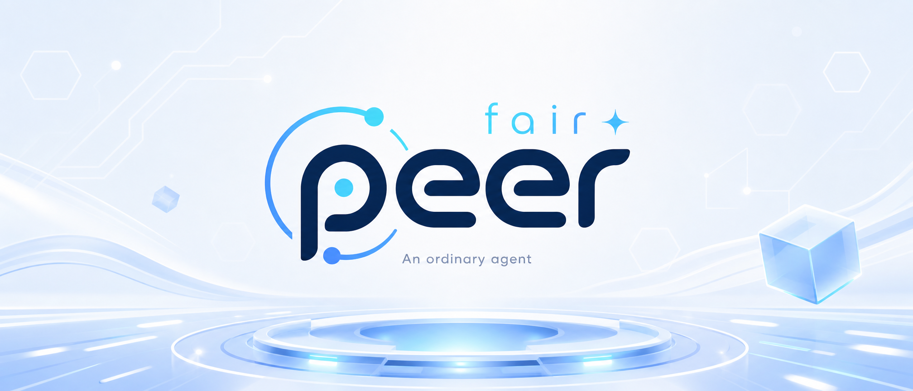

<p align="center">
  
</p>

<p align="center">
  <strong>English</strong>
  &nbsp;·&nbsp;
  <a href="./README_cn.md">简体中文</a>
  &nbsp;·&nbsp;
  <a href="./docs/GUIDE.md">User Guide</a>
  &nbsp;·&nbsp;
  <a href="./docs/SPEC.md">Architecture Spec</a>
</p>

<p align="center">
  <a href="https://github.com/zzycxz/hiq/releases"></a>
  <a href="https://github.com/zzycxz/hiq/actions/workflows/ci.yml"></a>
  <a href="./LICENSE"></a>
  <a href="https://github.com/zzycxz/hiq/stargazers"></a>
</p>

<br/>

<h3 align="center">Universal Multi-Vendor AI Coding Assistant + Office Automation Platform.</h3>
<p align="center">
  Connect to 18 vendors (11 direct + 7 Coding Plan aggregators), 300+ models.<br/>
  Built-in Word/Excel/PPT office automation capabilities.<br/>
  Single static Go binary, zero runtime dependencies, seamless cross-platform coverage.
</p>

<br/>

## What is hiq?

hiq is a **universal AI coding assistant** that supports 11 direct vendors and 7 Coding Plan aggregator platforms, providing complete office automation capabilities.

### Core Features

- 🌐 **Multi-Vendor Support** — 18 vendors, unified configuration management
- 💻 **Code Editing** — 5 editing strategies + 5-level fuzzy matching + checkpoint rollback
- 📄 **Office Automation** — Full Word/Excel/PPT support
- 🧠 **Smart Memory** — Two-layer long-term memory + Dream agent + RAG knowledge base
- 🎯 **Task Orchestration** — Auto-plan + Goal mode + Expert teams
- 🔧 **Plugin System** — Markdown Skill + MCP plugins
- 📷 **Screenshot Solver** — One-hotkey exam assistant, AI reads screen and answers

---

## 🚀 Quick Start

### Installation

```bash
# macOS / Linux
curl -fsSL https://hiq.dev/install.sh | bash

# Windows (PowerShell)
irm https://hiq.dev/install.ps1 | iex

# Or download from GitHub Releases
# https://github.com/zzycxz/hiq/releases
```

### Configuration

```bash
# Initialize configuration
hiq setup

# Or manually edit config file
vim ~/.config/hiq/hiq.toml
```

### Run

```bash
# Start interactive chat
hiq

# Execute a single task
hiq run "Help me write a Hello World"

# Start desktop app
hiq-desktop
```

---

## 🌐 Supported Vendors

### Direct Vendors (11)

| Vendor | Base URL | Default Model |
|--------|----------|---------------|
| Qwen | `https://dashscope.aliyuncs.com/compatible-mode/v1` | qwen3.7-max |
| DeepSeek | `https://api.deepseek.com` | deepseek-v4-pro |
| Volcengine | `https://ark.cn-beijing.volces.com/api/v3` | doubao-seed-evolving |
| Zhipu AI | `https://open.bigmodel.cn/api/paas/v4` | glm-5.2 |
| MiniMax | `https://api.minimaxi.com/v1` | minimax-m3 |
| Moonshot | `https://api.moonshot.cn/v1` | kimi-k3 |
| MiMo | `https://api.xiaomimimo.com/v1` | mimo-v2.5-pro |
| StepFun | `https://api.stepfun.com/v1` | step-3.7-flash |
| iFlytek MaaS | `https://spark-api-open.xf-yun.com/v1` | glm-5.2 |
| Anthropic | `https://api.anthropic.com` | claude-sonnet-5 |
| OpenAI | `https://api.openai.com/v1` | gpt-5.6-terra |

### Coding Plan Aggregators (7)

| Platform | Base URL | Description |
|----------|----------|-------------|
| Qwen Coding | `https://coding.dashscope.aliyuncs.com/v1` | Aggregates qwen/kimi/glm/minimax |
| Zhipu GLM Coding | `https://open.bigmodel.cn/api/coding/paas/v4` | GLM series |
| Volcengine Coding | `https://ark.cn-beijing.volces.com/api/coding/v3` | Aggregates doubao/deepseek/kimi |
| Baidu Qianfan | `https://qianfan.baidubce.com/v2/coding` | Aggregates ernie/glm/kimi/deepseek |
| Tencent TokenHub | `https://api.lkeap.cloud.tencent.com/coding/v1` | Aggregates deepseek/glm/kimi/minimax |
| StepFun Step Plan | `https://api.stepfun.com/step_plan/v1` | step series |
| iFlytek MaaS Coding | `https://maas-token-api.cn-huabei-1.xf-yun.com/v2` | Unified model ID |

---

## 📄 Office Automation

### Word Documents

```bash
# Create Word document
hiq run "Create a project report.docx with title, paragraphs and tables"

# Insert images
hiq run "Insert logo.png into report.docx"

# Generate table of contents
hiq run "Generate table of contents for report.docx"
```

### Excel Spreadsheets

```bash
# Create Excel spreadsheet
hiq run "Create sales_data.xlsx with months and sales"

# Add charts
hiq run "Add bar chart to sales_data.xlsx"

# Add conditional formatting
hiq run "Add conditional formatting to sales column in sales_data.xlsx"
```

### PowerPoint Presentations

```bash
# Create PPT
hiq run "Create a presentation about AI"

# Use template
hiq run "Create PPT using template, topic is digital transformation"

# Add animation
hiq run "Add fade-in animation to PPT"
```

---

## 🧠 Smart Memory System

### Long-term Memory

Hiq supports two-layer long-term memory:

1. **Document Layer** — `hiq.md` file, automatically loaded into context
2. **Auto Memory** — Dream agent automatically consolidates knowledge

### RAG Knowledge Base

```bash
# Import documents
hiq run "Import this PDF into knowledge base"

# Search knowledge base
hiq run "Search for authentication system knowledge"

# Answer questions using knowledge base
hiq run "Answer this technical question using knowledge base"
```

---

## 🎯 Task Orchestration

### Auto-plan (Automatic Planning)

```bash
# Complex tasks automatically trigger planning
hiq run "Refactor authentication module, add JWT support, write unit tests"
# → Auto plan → User approval → Execute
```

### Goal (Goal Mode)

```bash
# Autonomous execution until completion
hiq goal "Fix all TypeScript errors"
# → Autonomous work → Detect blockers → Complete/Report
```

### Expert Teams

```bash
# Multi-expert collaboration
hiq team review "Review this PR"
# → Security expert + Performance expert + Architecture expert → Comprehensive report
```

---

## 🔧 Plugin System

### Skills

```bash
# List available skills
hiq skill list

# Install skill
hiq skill install code-review

# Create custom skill
hiq skill new my-skill
```

### MCP Plugins

```toml
# hiq.toml
[[plugins]]
name = "my-mcp-server"
type = "stdio"
command = "node"
args = ["server.js"]
```

---

## ⚙️ Configuration

### Config File Locations

```
~/.config/hiq/hiq.toml    # Global config
./hiq.toml                     # Project config
./.env                              # Environment variables
```

### Configuration Example

```toml
# Default model
default_model = "deepseek/deepseek-v4-pro"

# Provider configuration
[[providers]]
name = "deepseek"
kind = "openai"
base_url = "https://api.deepseek.com"
api_key_env = "DEEPSEEK_API_KEY"
default = "deepseek-v4-pro"
fast_model = "deepseek-v4-flash"
context_window = 1000000

# Context management
[agent]
soft_compact_ratio = 0.5
compact_ratio = 0.8
compact_force_ratio = 0.9

# Office automation
[cowork]
vlm_model = "openai/gpt-4o"
screenshot_vlm_model = "openai/gpt-4o"
```

---

## 🛠️ Development

### Build

```bash
# Clone repository
git clone https://github.com/zzycxz/hiq.git
cd hiq

# Install dependencies
go mod download

# Build CLI
go build -o hiq ./cmd/hiq

# Build desktop app
cd desktop
wails build
```

### Test

```bash
# Run all tests
go test ./...

# Run specific tests
go test ./internal/config/...
```

---

## 📚 Documentation

| Reference | Content |
|-----------|---------|
| **[User Guide](docs/GUIDE.md)** | Permissions, sandbox, MCP plugins, slash commands, `@` syntax, Plan mode |
| **[Architecture Spec](docs/SPEC.md)** | Engineering contract: system architecture, registry mechanism, data types |
| **[Features](docs/HIQ_FEATURES.md)** | Complete feature panorama, architecture diagram, capability matrix |
| **[Office Automation](docs/OFFICE_GUIDE.md)** | Word/Excel/PPT automation, email integration, calendar tasks |
| **[RAG Knowledge Base](docs/RAG_GUIDE.md)** | Document import, knowledge graph, entity extraction, semantic search |
| **[Expert Teams](docs/EXPERT_GUIDE.md)** | Multi-model collaboration, team configuration, collaboration modes |
| **[Contributing](CONTRIBUTING.md)** | Developer guide: how to add new tools, providers, and bot channels |
| **[Changelog](CHANGELOG.md)** | Historical release records and feature iterations |

---

## 💰 Sponsorship

If you find Hiq useful, please consider sponsoring us. Your support will be used for:
- 🤖 Token purchases for development and testing
- 🚀 Feature development and maintenance
- 📚 Documentation improvements

### PayPal

[](https://www.paypal.com/paypalme/zzycxz)

### Alipay


---

## 🤝 Contributing

Contributions are welcome! Please see [CONTRIBUTING.md](CONTRIBUTING.md).

---

## 📄 License

MIT License - see [LICENSE](LICENSE)

---

## 🔗 Links

- [GitHub](https://github.com/zzycxz/hiq)
- [Documentation](https://hiq.dev)
- [Issues](https://github.com/zzycxz/hiq/issues)

---

**Hiq — The most powerful universal multi-vendor AI coding assistant!**
